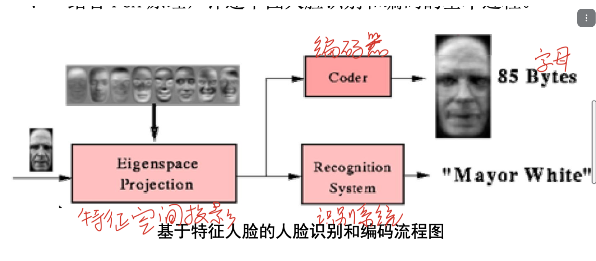

# 选择 2 x 10

- 人工智能的概念
- 哪个深度学习方法用于图像：CNN
- 哪个深度学习方法不能用于时序数据处理：CNN/RNN/LSTM/transformer
- 主成分分析原理
- 启发函数的概念
- （一道常识性人工智能伦理题）
- 下述哪个情况是过拟合

# 填空题 1 x 15

- 过拟合的概念
- 最小二乘法：用于线性回归的误差函数
- 

- 自然语言处理的四个任务：结构预测、匹配、分类、生成
- 人工智能主流方法，挖空让你写
1. 以符号主义为核心的逻辑推理 
2. 以数据驱动为核心的机器学习 
3. 以行为主义为核心的强化学习 
4. 以问题求解为核心的探寻搜索 
5. 以博弈对抗为核心的决策智能
- 无人系统的定义: 集感知、定位、决策、控制于一体
- 人工智能的治理手段：伦理，法律，政策，技术

# 大题 

## 逻辑推理：
已知：
①能够阅读的都是有文化的。
②海豚是没有文化的。
③某些海豚是有智能的。
用归结原理证明：某些有智能的并不能阅读。
## 简述人工智能的概念和发展历程

## 深度学习

推导3层bp神经网络,采用 Sigmoid 函数作为输出函数

## 分析使用PCA原理进行人脸识别和编码的方法

同作业题，但是没给下图

## 简述强化学习的原理，举一个例子

## 简述人工智能遇到的伦理和隐私的问题，应该怎么治理